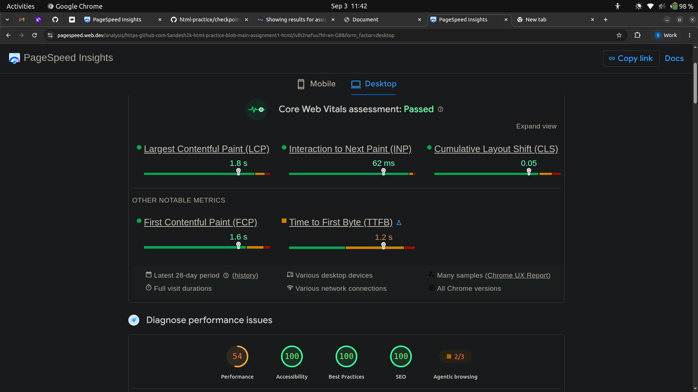

# Before
## PageSpeed

## Wave

### This evaluation shows 0 accessibility errors with 2 informational alerts related to external link and html5 video tag which does not represent a critical issue. In Pagespeed, it shows the performance score 50 as it depends on images or videos or any external resources which can increase loading time.

# After
## PageSpeed

### Now images is converted from png to webp format to reduce the file size which has stightly improved the page loading performance from 50 to 54.

